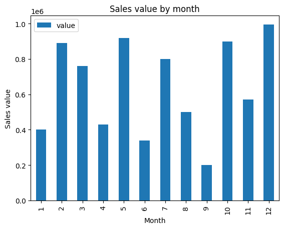
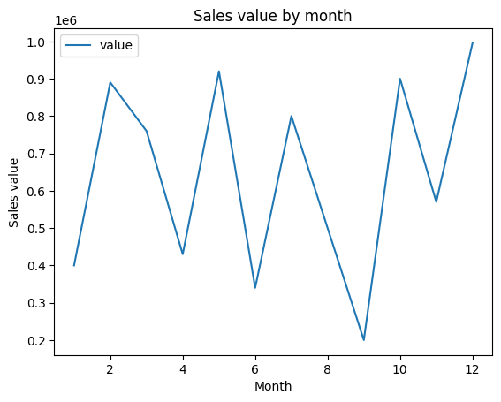

# Python Statistics Fundamentals

## Table of Contents
- [Overview](#overview)
- [Environment configuration](#environment-configuration)
- [Sales Mean](#sales-mean)
- [Vertical bar plot by month](#vertical-bar-plot-by-month)
- [Line plot by month](#line-plot-by-month)

## Overview

This project manipulates data from a dictionary using a DataFrame in Python for exploration. Matplotlib and Pandas are used in this project. 

There are two parameters in the input dictionary: 
- `date_ref`: date of reference
- `value`: sales value

To calculate sales mean, use Pandas DataFrame. Matplotlib generates a line plot and a vertical bar plot of sales by month.

## Environment configuration

Use a virtual environment (Pipenv in this case) to run the project.

Create a new virtual environment:
```
pipenv install pandas matplotlib
```

Enable virtual environment:
```
pipenv shell
```
 
## Sales mean

Sales mean are calculated using method `mean()` from pandas.

## Vertical bar plot by month

Using `pd.to_datetime(df['date_ref'])`, `date_ref` must be converted to datatime format to visualize sales value by month. Then, use `df['month'] = df['date_ref'].dt.month` to obtain the month reference in a new column. Plot the data using `df.plot.bar(x='month', y='value')` to obtain the following figure.



## Line plot by month

Using `month` and `value`, a line plot is created, like the image below.

